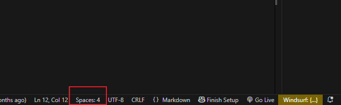
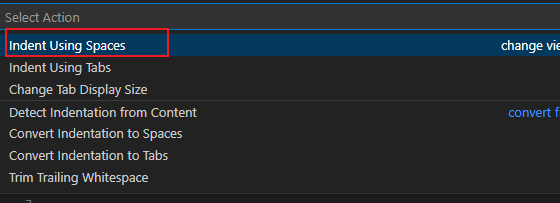
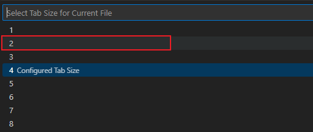

- [ZIONEX 개발 표준](https://drive.google.com/file/d/1sh8QeDpqFoeAKXoze73hE75x1zRY9wvE/view?usp=drive_link)

## Front-end

HTML, CSS, JavaScript, JSX 등의 Front-end source의 indentation(들여쓰기)은 2 spaces를 기준으로 함. VSCode의 설정 예는 다음과 같음.

### [설정 방법]

1. VSCode footer의 "Spaces: "설정 영역을 클릭.

2. "Indent Using Spaces"를 선택.

3. "2"를 선택.

이렇게 설정한 이후에는 2 spaces만큼씩 들여쓰기(indentation) 적용됨.

## Back-end

Java 등의 Back-end source의 indentation은 4 spaces를 기준으로 함. VSCode의 설정 예는 다음과 같음.

### [설정 방법]

1. VSCode footer의 "Spaces: "설정 영역을 클릭.
2. "Indent Using Spaces"를 선택.
3. "4"를 선택.

이렇게 설정한 이후에는 4 spaces만큼씩 들여쓰기(indentation) 적용됨.
