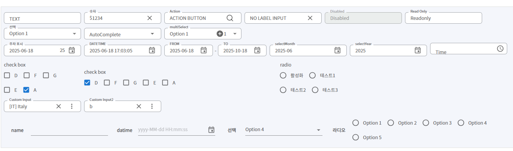

## Inputs
>솔루션에서 사용하는 다양한 input 스타일들을 모아 놓았습니다.

- `select`, `multiSelect`, `checkbox`, `radio`처럼 **옵션(option)** 구조를 가진 입력 타입은  
  label에 단순 문자열뿐 아니라 **React 컴포넌트**도 전달할 수 있습니다.  
  (예: Typography, Icon 등을 사용해 색상이나 강조 스타일 적용 가능)

```javascript
<SelectInput
  name="color"
  label="색상 선택"
  options={[
    { value: 'blue', label: <Typography sx={{ color: "red" }}>빨간색</Typography> },
    { value: 'red', label: <Typography sx={{ color: "red" }}>파란색</Typography> },
  ]}
/>
```

**파일명:**  `Sample06.jsx`



- type : text, number, select, multiSelect, autocomplete, check, radio, datetime, time, dataeRange, popover, action, custom

### input type
#### 1. text: **텍스트 입력 (Text Input)**
- **설명**: 기본적인 텍스트 입력 필드로, 사용자가 문자열을 입력할 수 있습니다.

#### 2. number: **숫자 입력 (Number Input)**
- **설명**: 숫자를 입력받는 필드로, 숫자 데이터를 처리할 때 사용됩니다.

#### 3. action: **액션 버튼 (Action Button)**
- **설명**: 입력 필드에 버튼을 포함하여 특정 작업을 실행할 수 있는 필드입니다. 

#### 4. select: **선택 입력 (Select Input)**
- **설명**: 드롭다운 메뉴를 통해 여러 옵션 중 하나를 선택할 수 있는 필드입니다. 특정 옵션에 색을 표시하는 등의 `스타일 추가`가 필요할때는 class 를 통해 제어할 수 있습니다. (샘플에 구현 되어있음)

#### 5. autocomplete: **자동 완성 입력 (AutoComplete)**
- **설명**: 사용자가 입력을 시작하면 추천 옵션을 제공하는 입력 필드입니다.

#### 6. multiSelect: **다중 선택 입력 (MultiSelect)**
- **설명**: 여러 개의 항목을 동시에 선택할 수 있는 필드입니다. value 값이 배열 형태 입니다.
- props
  - max: 선택 갯수 제한

#### 7. datetime, daterange, time: **날짜 및 시간 입력 (DateTime, DateRange)**
- **설명**: 날짜, 시간 또는 날짜 범위를 선택할 수 있는 입력 필드입니다. 

#### 8. check: **체크박스 입력 (Checkbox)**
- **설명**: 여러 개의 옵션 중 원하는 항목을 선택할 수 있는 체크박스 형태의 필드입니다.

#### 9. radio: **라디오 버튼 입력 (Radio Button)**
- **설명**: 여러 개의 옵션 중 하나만 선택할 수 있는 라디오 버튼 형태의 필드입니다.

#### 10. popover: **팝오버 입력 (Popover Input)**
- **설명**: 팝업 창을 통해 추가적인 입력 또는 선택을 할 수 있는 필드입니다.

#### 11. **레이블 텍스트 입력 (LabelText)**
- **설명**: 레이블과 함께 텍스트 또는 다른 타입의 입력을 받을 수 있는 필드입니다. 표준 스타일은 아니지만 필요한 경우 사용할 수 있습니다.

------


**속성** : 
  - `name`: 폼 필드의 이름.
 
  - `label`: 필드 레이블 텍스트.
 
  - `control`: `react-hook-form`의 `control` 객체.
 
  - `value`: 초기값 설정.

  - `dateformat`: 날짜 포맷 지정.
  
  - `displayType`: `권장` (글로벌 포맷 설정 적용) 날짜 포맷 지정.  "year" | "yearMonth" | "date" | "datetime" (기본값: datetime). 
   
  - `options`: 선택 가능한 옵션 배열.

  - `startAdornment`: 필드 앞에 붙는 텍스트 또는 기호.

  - `childComponent`: 팝업 내에 렌더링할 컴포넌트.

  - `readOnly`: true 로 설정시 입력 필드를 읽기 전용으로 설정.

  - `disabled`: true 로 설정시 입력 필드를 비활성화 상태로 설정. 기본 HTML의 disabled 속성과 달리, react-hook-form에서는 비활성화된 필드의 값도 폼 제출 시 포함됨.

  - `validationText`: 유효성 검사 시 표시할 메시지.
 
  - `rules`: 유효성 검사 규칙 설정.
