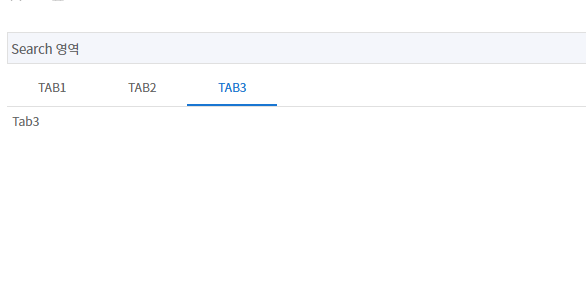

## 탭
**샘플 파일명:**  `Sample05.jsx`



### TabContainer 
 > 탭을 감싸는 container. <br/>
 > Childrens 는 id를 key 값으로 구분함

| 속성 명 |  값 | default | 설명 |
|--------|:--------:|:--------:|--------|
| value | | | |
| onChange | |  |  |

```jsx
import React, { useState, useEffect } from "react";
import {
  ContentInner, SearchArea, WorkArea, ResultArea, ButtonArea, LeftButtonArea, RightButtonArea, SearchRow,
  InputField, BaseGrid, GridAddRowButton, GridDeleteRowButton, GridSaveButton, useContentStore,
  useIconStyles, useViewStore, zAxios,
  SplitPanel, HLayoutBox, VLayoutBox
} from "@wingui/common/imports";
import { TabContainer } from '@zionex/wingui-core/component/TabContainer';
import { Box } from "@mui/material";

function Sample04() {
  const [tabValue, setTabValue] = useState('tab1');
  const tabChange = (event, newValue) => {
    setTabValue(newValue);
  };

  return (
    <ContentInner>
      <SearchArea>
        <SearchRow>
          Search 영역
        </SearchRow>
      </SearchArea>
      <WorkArea>
        <TabContainer value={tabValue} onChange={tabChange}>
          <Box id="tab1">Tab1</Box>
          <Box id="tab2">Tab2</Box>
          <Box id="tab3">Tab3</Box>
        </TabContainer>
      </WorkArea>
  </ContentInner>
  );
}


export default Sample04
```