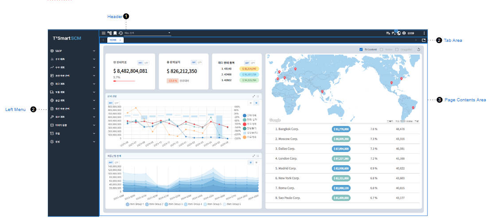
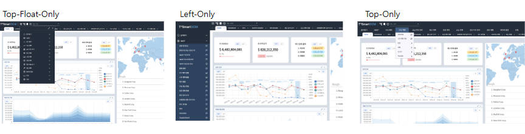
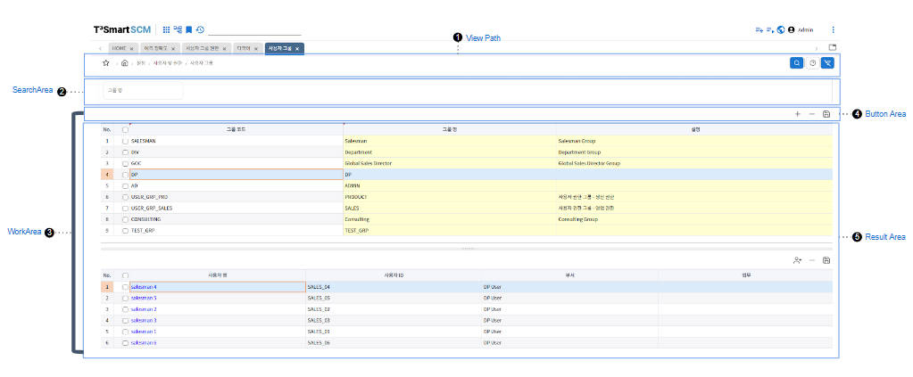
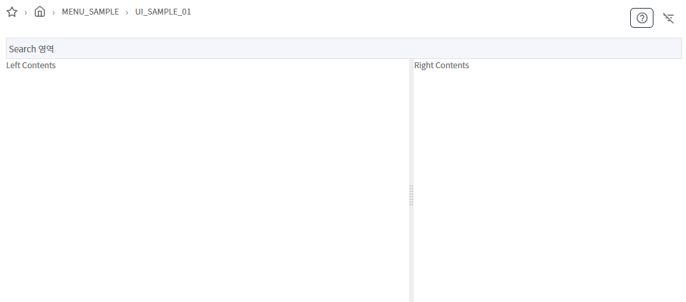
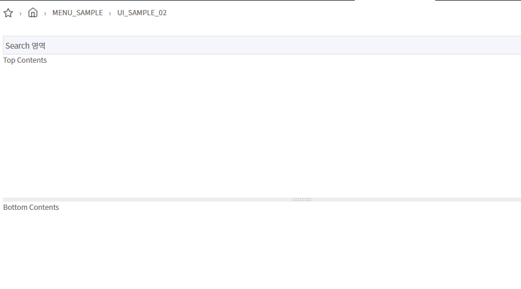
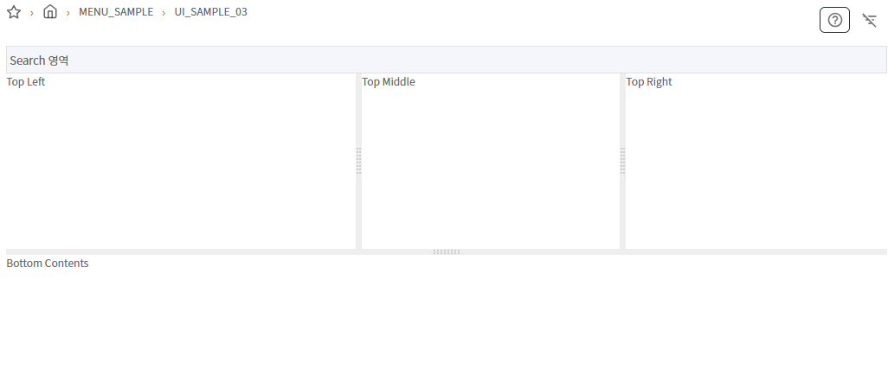

## 레이아웃 구성 

### Frame layout 
Frame 구조는 Header, LeftMenu, Contents Area 로 구성됩니다.
Navigation Type은 Top-Float-Only, Top-Only, Left-Only 의 기본 3가지가 있습니다. 

기본 Nvation type 설정은 uiSettings.js 파일에서 수정할 수 있습니다.
```javascript
defaultMenuType: 'floatMenu',// ['sideBarMenu','topMenu','floatMenu']
```




### content area layout



### 1. 수직레이아웃
**파일명:**  `Sample01.jsx`



#### SplitPanel 
> 레이아웃을 수평/수직으로 분리하는 Component 

| 속성 명 |  값 | default | 설명 |
|--------|:--------:|:--------:|--------|
| sizes | [50, 50] | [50, 50] |화면 비율. default: [50, 50], 합계가 100이 되게 배열로 구성 |
| direction | `vertical`, `horizontal` | vertical | 방향 |

#### HLayoutBox 
 > 수평 레이아웃을 구성하는 박스


```jsx
import React, { useState, useEffect } from "react";
import {
  ContentInner, SearchArea, WorkArea, ResultArea, ButtonArea, LeftButtonArea, RightButtonArea, SearchRow,
  InputField, BaseGrid, GridAddRowButton, GridDeleteRowButton, GridSaveButton, useContentStore,
  useIconStyles, useViewStore, zAxios,
  SplitPanel, HLayoutBox, VLayoutBox
} from "@wingui/common/imports";

function Sample01() {
  return (
    <ContentInner>
      <SearchArea>
        <SearchRow>
          Search 영역
        </SearchRow>
      </SearchArea>
      <WorkArea>
        <SplitPanel sizes={[60, 40]} direction={"horizontal"}>
          <HLayoutBox>
            Left Contents
          </HLayoutBox>
          <HLayoutBox>
            Right Contents
          </HLayoutBox>
        </SplitPanel>
      </WorkArea>
  </ContentInner>
  );
}


export default Sample01
```

### 2. 수직 레이아웃 
**파일명:**  `Sample02.jsx`


#### VLayoutBox 
 > 수직 레이아웃을 구성하는 박스


```jsx
// Sample02.jsx
import React, { useState, useEffect } from "react";
import {
  ContentInner, SearchArea, WorkArea, ResultArea, ButtonArea, LeftButtonArea, RightButtonArea, SearchRow,
  InputField, BaseGrid, GridAddRowButton, GridDeleteRowButton, GridSaveButton, useContentStore,
  useIconStyles, useViewStore, zAxios,
  SplitPanel, VLayoutBox 
} from "@wingui/common/imports";

function Sample02() {
  return (
    <ContentInner>
      <SearchArea>
        <SearchRow>
          Search 영역
        </SearchRow>
      </SearchArea>
      <WorkArea>
        <SplitPanel sizes={[60, 40]} direction={"vertical"}>
          <VLayoutBox>
            Top Contents
          </VLayoutBox>
          <VLayoutBox>
            Bottom Contents
          </VLayoutBox>
        </SplitPanel>
      </WorkArea>
  </ContentInner>
  );
}


export default Sample02
```

### 3. 복합 레이아웃 
**파일명:**  `Sample03.jsx`


```jsx
import React, { useState, useEffect } from "react";
import {
  ContentInner, SearchArea, WorkArea, ResultArea, ButtonArea, LeftButtonArea, RightButtonArea, SearchRow,
  InputField, BaseGrid, GridAddRowButton, GridDeleteRowButton, GridSaveButton, useContentStore,
  useIconStyles, useViewStore, zAxios,
  SplitPanel, HLayoutBox, VLayoutBox
} from "@wingui/common/imports";

function Sample03() {
  return (
    <ContentInner>
      <SearchArea>
        <SearchRow>
          Search 영역
        </SearchRow>
      </SearchArea>
      <WorkArea>
        <SplitPanel>
          <VLayoutBox>
            <SplitPanel sizes={[40, 30, 30]} direction={"horizontal"}>
              <HLayoutBox>
                Top Left
              </HLayoutBox>
              <HLayoutBox>
                Top Middle
              </HLayoutBox>
              <HLayoutBox>
                Top Right
              </HLayoutBox>
            </SplitPanel>
          </VLayoutBox>
          <VLayoutBox>
            Bottom Contents
          </VLayoutBox>
        </SplitPanel>
      </WorkArea>
  </ContentInner>
  );
}


export default Sample03
```