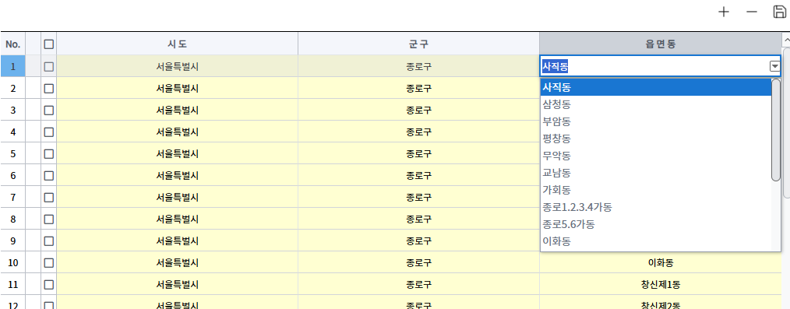

## Grid LookupTree
**샘플 파일명:**  `Practice09.jsx`, `areacodes.js`

>컬럼에 연결된 데이터 필드의 실제 값 대신 그 값과 연관된 다른 값을 셀에 표시합니다. 보통 상위 컬럼 값에 따라 자기 컬럼의 dropDown 목록이 변경되는경우 사용합니다.

- Plant 별로 dropdown 이 별도로 구성되어야 할때 주로 사용함 ( ex: plant 별 item 구성)
- 리얼그리드 이벤트로 강제로 만들 수는 있으나 권장하지 않음. 

[참고링크](https://docs.realgrid.com/guides/cell-components/lookup-tree)