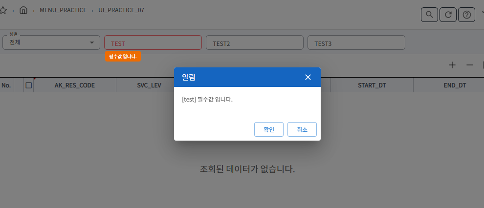

## input Field 유효성 검사
**샘플 파일명:**  `Practice07.jsx`




### input 유효성 검사
- [reack-hook-form validation](https://react-hook-form.com/docs/useform/register#options)
- List of validation rules supported:
  - required
  - min
  - max
  - minLength
  - maxLength
  - pattern
  - validate


```javascript
import { onErrorInput } from "@zionex/wingui-core/utils/common";
 // globalButtons
  const globalButtons = [
    { name: 'search', action: (e) => { handleSubmit(loadData, onErrorInput)() }, visible: true, disable: false },
    { name: "refresh", action: (e) => { refresh() }, visible: true, disable: false },
  ];

<InputField type="select" name="gender" control={control} label={transLangKey('GENDER')} options={genderOption} rules={{ required: transLangKey('FP_MSG_FIELD_REQUIRED') }}/>
        <InputField type="text" name="test" control={control} label={transLangKey('TEST')} rules={{ required: transLangKey('FP_MSG_FIELD_REQUIRED') }}/>
        <InputField type="number" name="test2" control={control} label={transLangKey("TEST2")}
          rules={{
            maxLength: {
              value: 2,
              message: "error message",
            },
          }}
        />
        <InputField type="text" name="test3" control={control} label={transLangKey("TEST3")}
          rules={{
            pattern: {
              value: /[A-Za-z]{3}/,
              message: 'error message' 
            }
          }}
        />
```