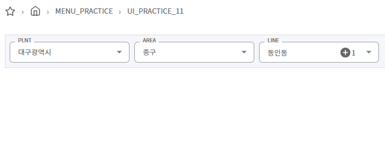

## 연계 검색 컴포넌트
**샘플 파일명:**  `Practice11.jsx`




`HierarchyInputField`는 연계된 계층형 드롭다운 컴포넌트입니다.
각 단계는 상위 항목에 따라 동적으로 필터링되며, `select`, `multiSelect` 타입을 선택할 수 있습니다.
시/군/구 같은 행정구역 외에도 **품목 → 품목군 → 세부품목**, **회사 → 부서 → 팀**, **카테고리 → 서브카테고리 → 제품** 등의 다양한 트리형 데이터를 표현할 수 있습니다.

## 옵션 설명

| 옵션 이름     | 타입         | 설명 |
|--------------|--------------|------|
| `items`      | `string[]`   | 계층 구조에 사용할 key 이름들입니다. |
| `labels`     | `string[]`   | 각 단계에 표시될 라벨들입니다. 미 입력시 items 다국어로 자동 셋팅 |
| `type`       | `string[]`   | `select` 또는 `multiSelect`로 각 단계의 선택 방식 지정 |
| `allflag`    | `boolean[]`  | 각 단계에서 '전체 선택(ALL)' 옵션을 노출할지 여부 |
| `rtnAllYn`   | `boolean[]`  | allflag 가 'true' 일 때, 전체 선택 시 텍스트 `ALL` 로 받을지 여부, 'false' 일때 배열 반환 |

---

## 사용 데이터 구조
- 단계 별 데이터를 하나의 array로 표현합니다.

```json
[
  { "PLNT_CD": "11", "PLNT_NM": "서울특별시", "AREA_CD": "11010", "AREA_NM": "종로구", "LINE_CD": "1101053", "LINE_NM": "사직동" },
  { "PLNT_CD": "11", "PLNT_NM": "서울특별시", "AREA_CD": "11010", "AREA_NM": "종로구", "LINE_CD": "1101054", "LINE_NM": "삼청동" },
  ...
  { "PLNT_CD": "11", "PLNT_NM": "서울특별시", "AREA_CD": "11710", "AREA_NM": "송파구", "LINE_CD": "1171052", "LINE_NM": "가락동" }
]
```

---

## 기본 상태 설정
```javascript
const hierarchyInputRef = useRef();
const [hierarchyItems, setHierarchyItems] = useState([]);
const [itemTreeInitialized, setItemTreeInitialized] = useState(false); //기본값 셋팅 시 필요
```

---

## 컴포넌트 구성
```javascript
<HierarchyInputField
  ref={hierarchyInputRef}
  data={hierarchyItems}
  onChange={handleSelectionChange}
  option={{
    items: ["PLNT", "AREA", "LINE"],
    labels: ["PLNT", "AREA", "LINE"],
    type: ["select", "select", "multiSelect"],
    allflag: [false, false, true],
    rtnAllYn: [true, false, true],
  }}
/>
```

---

## 기본값 설정
```javascript
useEffect(() => {
  if (itemTreeInitialized && hierarchyInputRef.current) {
    hierarchyInputRef.current.setValues([
      { "PLNT_CD": "27", "AREA_CD": "27110", "LINE_CD": ["2711051", "2711052"] }
    ]);
  }
}, [itemTreeInitialized]);
```

---

## 이벤트 핸들링
```javascript
const handleSelectionChange = (selectedValues) => {
  console.log('선택된 값:', selectedValues);
};
```

---

## 선택된 값 가져오기 
컴포넌트 외부에서 선택된 값을 가져오고 싶을 때는 다음과 같이 `ref.getValues()`를 활용할 수 있습니다:

```javascript
const firstValue = hierarchyInputRef.current.getValues()?.PLNT;
const secondValue = hierarchyInputRef.current.getValues()?.AREA;
const thirdValue = hierarchyInputRef.current.getValues()?.LINE;

console.log('선택된 PLNT:', firstValue);
console.log('선택된 AREA:', secondValue);
console.log('선택된 LINE:', thirdValue);
```


## 리셋
```javascript
hierarchyInputRef.current.reset();
```