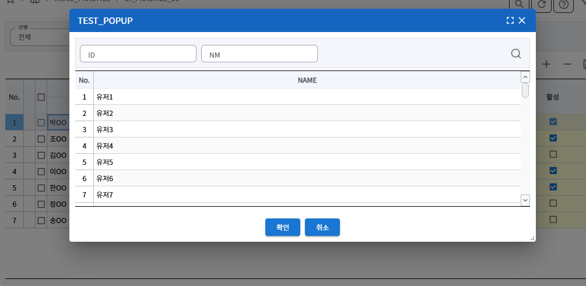

## 팝업
**샘플 파일명:**  `Practice06.jsx`, `PopName.jsx`




이 예제는 두 가지 상황에서 팝업을 호출하고 데이터를 가져오는 방법을 보여줍니다. 팝업을 호출하고 confirm props 를 통해 팝업에서 데이터를 가져오는 방법은 거의 동일합니다.
1. Search 영역의 Input에서 팝업 호출: 사용자가 Search 영역의 입력 필드를 통해 팝업을 호출하는 예제입니다.
2. Grid 영역에서 팝업 호출: Grid 영역에서 팝업을 호출하여 데이터를 가져오는 샘플입니다

### 팝업 구성
- PopupDialog 컴포넌트로 팝업을 구현
- PopupDialog props: open, onClose , onSubmit, title, resizeHeight, resizeWidth, checks
  - resizeWidth : default 400, popup창 가로 크기
  - resizeHeight : default 300, popup창 세로 크기
  - `checks`
    
    기본적으로 화면(이너탭)삭제, 조회, 팝업 닫기 할 때 그리드의 업데이트 체크를 하여
'저장되지 않은 데이터가 있습니다, 계속하시겠습니까?' 와 같은 알림 메세지를 띄웁니다.
이에 여러 예외 케이스가 발생되어 개선할 수 있도록 가이드를 드립니다.
1.팝업 그리드의 변경 사항에 대해 메인 그리드의 업데이트 상태 체크에 영향을 주지 않기 위해 아래와 같이 설정합니다.
  
    checks props 로 설정한 그리드에 대해서만 업데이트 상태를 체크하도록 합니다.
    ```javascript
    <PopupDialog type="NOBUTTONS" open={props.open} onClose={props.onClose} checks={[itemGroupMasterGrid]} ~ >
    ``` 
    위의 설정이 없는 화면의 경우에서는 모든 그리드(팝업그리드, parent그리드)를 체크하는 것을 기본으로 합니다


#### zAxios 
팝업에서 zAxios 호출 시 waitOn이 parent 영역이 아닌 popup 영역에서 작동되도록 **`fromPopup: true`** 를 붙인다.
fromPopup: true
```javascript
zAxios({      
      method: "post",
      url: "url",
      data: param,
      fromPopup: true,
    }).then(function (res) {

    }).catch(function (err) {
      console.log(err);
    });
```